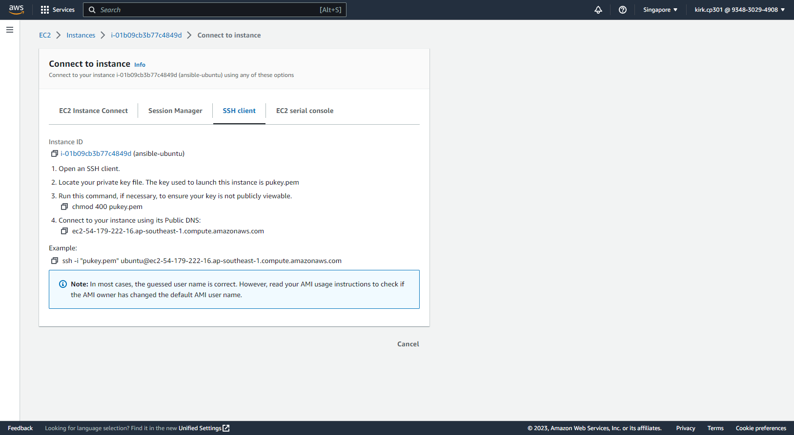

# How To Deploy a Static HTML Website with Ansible on AWS Ubuntu
Ansible is an open-source configuration management and application deployment tool. It helps to reduce managerial overhead by automating the deployment of the app and managing IT infrastructure.

## Step 1: Go to EC2 in your AWS Console.

---
## Step 2: Create 4 instances (one for your main Ansible machine and 3 for your servers that you want to be automated).


---
## Step 3: Connect to your instaces.

- **Download your SSH key**

- **Ensure that your key is not publicly available by modifying its permissions**
```bash
> chmod 400 "SSHkey".pem
```

- **Connect through your instances using SSH**
```bash
> ssh -i "SSHkey"" ubuntu@ec2-13-250-103-32.ap-southeast-1.compute.amazonaws.com
```

---
## Step 4: In your main Ansible machine, update the system and install needed dependencies.
```bash
> sudo apt update
```

```bash
> sudo apt install software-properties-common
```

```bash
> sudo apt-add-repository --yes --update ppa:ansible/ansible
```

---
## Step 5: Install Ansible in your main machine and check its version for verification.
```bash
> sudo apt install ansible -y
```

```bash
> ansible --version
```

---
## Step 6: Create a hosts file and input the servers' IP addresses that to be automated.
- **Grab your servers' IP addresses**
```bash
sudo apt install net-tools
> ifconfig
```

- **Create a directory for your hosts file**
```bash
> mkdir inventory
```

- **Paste gathered IP addresses in your hosts file**
```bash
> vi ihosts
```


---
## Step 7: Authorize the servers' by generating SSH key.
- **From your main machine, generate SSH key**
```bash
> ssh-keygen -t rsa -b 2046
```

- **Concatinate and copy the generated key**
```bash
> cd /home/ubuntu/.ssh/
> cat id_rsa.pub
```

- **Paste copied generated key to authorized_keys in your server machines**
```bash
> cd .ssh
> vi authorized_keys
```


---
## Step 8: Test the servers by passing the desired group name and using ping module.
```bash
> ansible -i ./inventory/hosts ubuntu-server -m ping
```

---
## Step 9: Create a playbook (.yml).
- **Create directory for your playbook**
```bash
> mkdir playbooks/
> cd playbooks/
> nvim apt.yml
```

- **Paste the commands below or you can write your own**
```yml
---
- hosts: all
  become: yes
  vars:
    server_name: "{{ ansible_default_ipv4.address }}"
    document_root: /var/www
    app_root: /var/www/
  tasks:
    - name: Update apt cache and install Nginx
      apt:
        name: nginx
        state: latest
        update_cache: yes

    - name: Copy website files to the server's document root
      copy:
        src: "{{ app_root }}"
        dest: "{{ document_root }}"
        mode: preserve

    - name: Apply Nginx template
      template:
        src: /var/www/nginx.conf.j2
        dest: /etc/nginx/sites-available/default
      notify: Restart Nginx

    - name: Enable new site
      file:
        src: /etc/nginx/sites-available/default
        dest: /etc/nginx/sites-enabled/default
        state: link
      notify: Restart Nginx

    - name: Allow all access to tcp port 80
      ufw:
        rule: allow
        port: '80'
        proto: tcp

  handlers:
    - name: Restart Nginx
      service:
        name: nginx
        state: restarted
```

---
## Step 10: Obtain and unzip demo website.
- **Download the demo website**
```bash
> cd /var/www/
> sudo curl -L https://github.com/do-community/html_demo_site/archive/refs/heads/main.zip -o html_demo.zip
```

- **Download the unzip app to extract zip content**
```bash
> sudo apt install unzip -y
> unzip html_demo.zip
```

---
## Step 11: Create a template for nginx's configuration.
```bash
> cd /var/www
> sudo vi nginx.conf.j2
```

- **Paste nginx's configuration below**
```j2
server {
  listen 80;

  root {{ document_root }}/{{ app_root }};
  index index.html index.htm;

  server_name {{ server_name }};
  
  location / {
   default_type "text/html";
   try_files $uri.html $uri $uri/ =404;
  }
}
```

---
## Step 12: Execute playbook.
```bash
> ansible-playbook -i ./inventory/hosts ./playbooks/apt.yml -u ubuntu
```

*Note: ideally, your output should look the same as the image above*
---
## Step 13: Test your sites by using the public IPv4 addresses of your server machines.
- **For ansible-server1**

- **For ansible-server2**

- **For ansible-server3**

