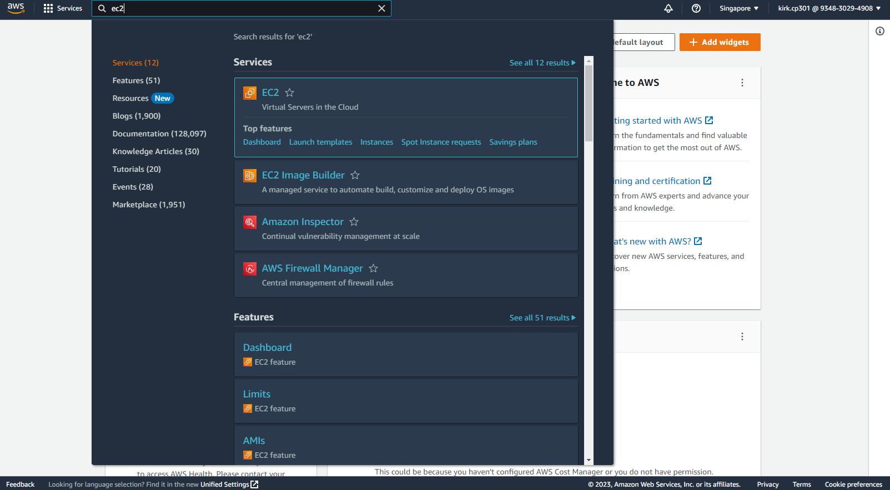
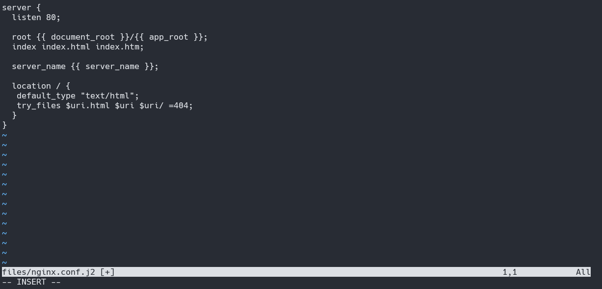

# Deploying a Static HTML Website with Ansible on AWS Ubuntu

Streamline your website deployment process using Ansible, an open-source configuration management and application deployment tool. Automate the setup of your app and manage your IT infrastructure efficiently.

## Step 1: Navigate to EC2 in Your AWS Console


---

## Step 2: Create 4 Instances
Set up 4 instances - one for your primary Ansible machine and 3 for the servers you want to automate.


---

## Step 3: Connect to Your Instances
1. **Download Your SSH Key**


2. **Secure Your Key Permissions**
```bash
> chmod 400 "SSHkey".pem
```


3. **Connect via SSH**
```bash
> ssh -i "SSHkey"" ubuntu@ec2-13-250-103-32.ap-southeast-1.compute.amazonaws.com
```


---

## Step 4: Update and Install Dependencies
```bash
> sudo apt update
```


```bash
> sudo apt install software-properties-common
```


```bash
> sudo apt-add-repository --yes --update ppa:ansible/ansible
```


---

## Step 5: Install Ansible and Verify
```bash
> sudo apt install ansible -y
```


```bash
> ansible --version
```


---

## Step 6: Create a Host File
1. **Obtain Server IP Addresses**
```bash
> sudo apt install net-tools
> ifconfig
```


2. **Create a Hosts File Directory**
```bash
> mkdir inventory
```


3. **Populate the Hosts File with IP Addresses**
```bash
> vi hosts
```


---

## Step 7: Authorize Servers with SSH Key
1. **Generate an SSH Key on Your Main Machine**
```bash
> ssh-keygen -t rsa -b 2046
```


2. **Concatenate and Copy the Generated Key**
```bash
> cd /home/ubuntu/.ssh/
> cat id_rsa.pub
```


3. **Paste the Copied Key into the authorized_keys File on Server Machines**
```bash
> cd .ssh
> vi authorized_keys
```


---

## Step 8: Test Server Connectivity
```bash
> ansible -i ./inventory/hosts ubuntu-server -m ping
```


---

## Step 9: Create an Ansible Playbook (.yml)
1. **Set Up a Directory for Your Playbook**
```bash
> mkdir playbooks/
> cd playbooks/
> vim apt.yml
```


2. **Add the Following Commands (or Customize as Needed)**
```yml
---
- hosts: all
  become: yes
  vars:
    server_name: "{{ ansible_default_ipv4.address }}"
    document_root: /var/www
    app_root: /var/www/
  tasks:
    - name: Update apt cache and install Nginx
      apt:
        name: nginx
        state: latest
        update_cache: yes

    - name: Copy website files to the server's document root
      copy:
        src: "{{ app_root }}"
        dest: "{{ document_root }}"
        mode: preserve

    - name: Apply Nginx template
      template:
        src: /var/www/nginx.conf.j2
        dest: /etc/nginx/sites-available/default
      notify: Restart Nginx

    - name: Enable new site
      file:
        src: /etc/nginx/sites-available/default
        dest: /etc/nginx/sites-enabled/default
        state: link
      notify: Restart Nginx

    - name: Allow all access to tcp port 80
      ufw:
        rule: allow
        port: '80'
        proto: tcp

  handlers:
    - name: Restart Nginx
      service:
        name: nginx
        state: restarted
```


---

## Step 10: Obtain and Unzip a Demo Website
1. **Download the Demo Website**
```bash
> cd /var/www/
> sudo curl -L https://github.com/do-community/html_demo_site/archive/refs/heads/main.zip -o html_demo.zip
```


2. **Install the Unzip App and Extract Zip Content**
```bash
> sudo apt install unzip -y
> unzip html_demo.zip
```


---

## Step 11: Create an Nginx Configuration Template
```bash
> cd /var/www
> sudo vi nginx.conf.j2
```


2. **Paste the Nginx Configuration Below**
```j2
server {
  listen 80;

  root {{ document_root }}/{{ app_root }};
  index index.html index.htm;

  server_name {{ server_name }};
  
  location / {
   default_type "text/html";
   try_files $uri.html $uri $uri/ =404;
  }
}
```


---

## Step 12: Execute the Ansible Playbook
```bash
> ansible-playbook -i ./inventory/hosts ./playbooks/apt.yml -u ubuntu
``

`


*Note: Your output should ideally resemble the image above.*

---

## Step 13: Test Your Deployed Websites
- **For ansible-server1**

- **For ansible-server2**

- **For ansible-server3**

